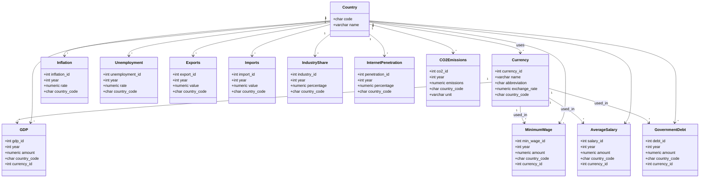

# UML CLASS DIAGRAM

```mermaid
classDiagram

class Currency {
  +int currency_id
  +varchar name
  +char abbreviation
  +numeric exchange_rate
  +char country_code
}

class GDP {
  +int gdp_id
  +int year
  +numeric amount
  +char country_code
  +int currency_id
}

class Inflation {
  +int inflation_id
  +int year
  +numeric rate
  +char country_code
}

class Unemployment {
  +int unemployment_id
  +int year
  +numeric rate
  +char country_code
}

class MinimumWage {
  +int min_wage_id
  +int year
  +numeric amount
  +char country_code
  +int currency_id
}

class AverageSalary {
  +int salary_id
  +int year
  +numeric amount
  +char country_code
  +int currency_id
}

class Exports {
  +int export_id
  +int year
  +numeric value
  +char country_code
}

class Imports {
  +int import_id
  +int year
  +numeric value
  +char country_code
}

class IndustryShare {
  +int industry_id
  +int year
  +numeric percentage
  +char country_code
}

class GovernmentDebt {
  +int debt_id
  +int year
  +numeric amount
  +char country_code
  +int currency_id
}

class InternetPenetration {
  +int penetration_id
  +int year
  +numeric percentage
  +char country_code
}

class CO2Emissions {
  +int co2_id
  +int year
  +numeric emissions
  +char country_code
  +varchar unit
}

class Country {
  +char code
  +varchar name
}

Country "1" --> "*" Currency : uses
Currency "1" --> "*" GDP : referenced_by
Currency "1" --> "*" MinimumWage : used_in
Currency "1" --> "*" AverageSalary : used_in
Currency "1" --> "*" GovernmentDebt : used_in

Country "1" --> "*" GDP
Country "1" --> "*" Inflation
Country "1" --> "*" Unemployment
Country "1" --> "*" MinimumWage
Country "1" --> "*" AverageSalary
Country "1" --> "*" Exports
Country "1" --> "*" Imports
Country "1" --> "*" IndustryShare
Country "1" --> "*" GovernmentDebt
Country "1" --> "*" InternetPenetration
Country "1" --> "*" CO2Emissions
```
